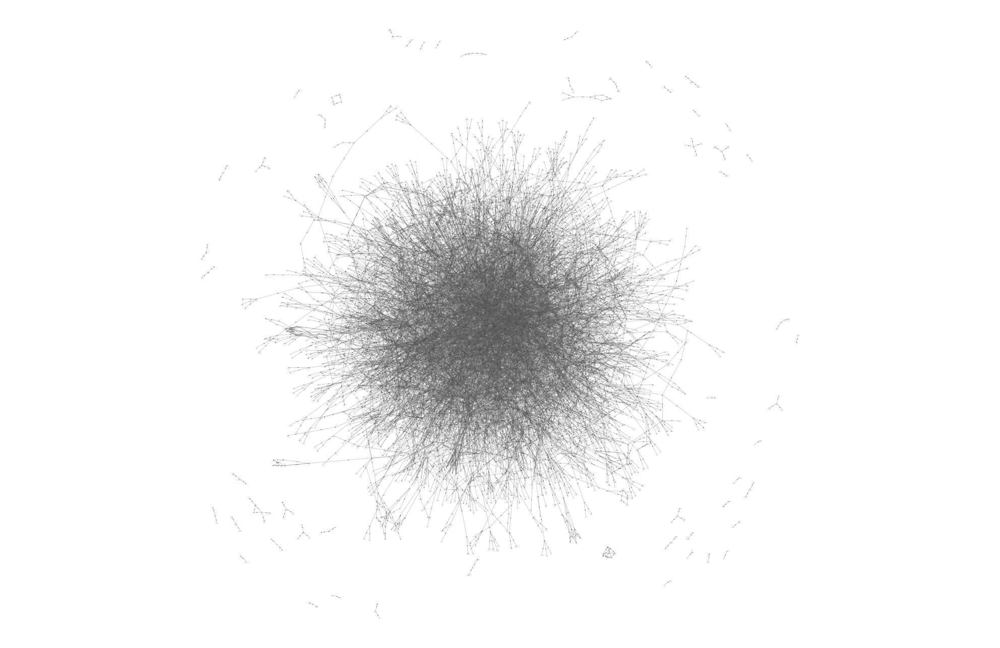

# ⛓️‍💥 Word Chains

Exploring word definition networks, i.e: how do words used in other word's definitions create a network.
Read the [blog post](https://petargyurov.com/2025-06-22/word-chains).

## How to use

- use `generate_chains.py` to create the `chains.js` file (or just grab it from `data/chains.js`)
  - you'll need to install the [Wn package](https://wn.readthedocs.io/en/latest/)
- use `solveNetwork.html` to visualise a network using physics (and export it)
- use `visualiseNetwork.html` to visualise a pre-computed network

Inside the `data/` folder you will find:

- `chains.js`: pre-computed nodes and edges
- `largeNetwork.js`: pre-computed network of 5839 nodes and 10000 edges
- `smallNetwork.js`: pre-computed network of ~1000 nodes

## Notes

- `solveNetwork.html` is currently limiting the number of edges to 10000, feel free to change
- `visualiseNetwork.html` is setting `physics` and `improvedLayout` to `true`; set these to `false` if visualising the large network.
